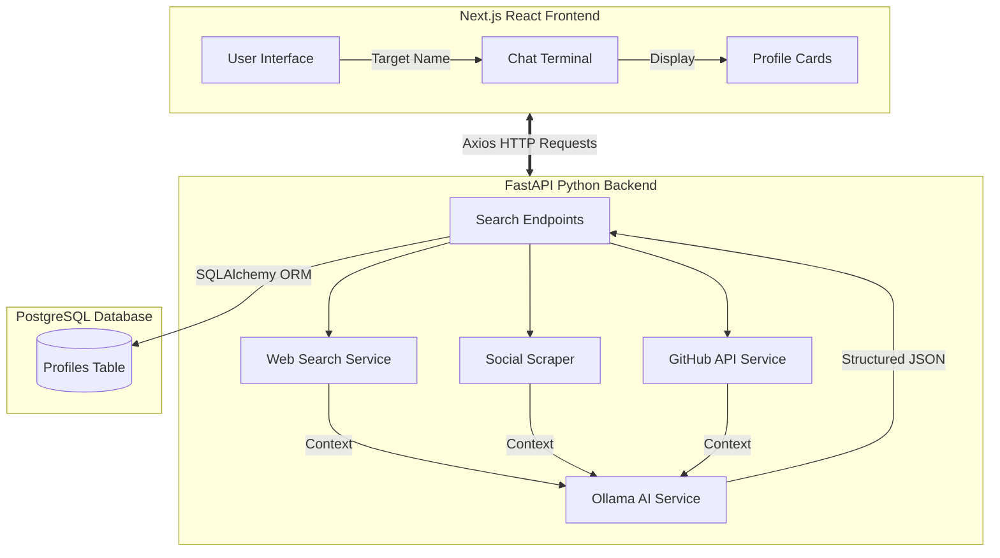

<div align="center">
  <h1>J.A.R.V.I.S</h1>
  <p><strong>Just A Rather Very Intelligent System</strong></p>
  <p><em>AI-Powered Web Scraping and Profile Analysis Assistant</em></p>

  <div>
    
    
    
    
  </div>
  <div style="margin-top: 5px;">
    
    
    
    
  </div>
</div>

<br />

## Overview

Inspired by Tony Stark's AI, **J.A.R.V.I.S** is a full-stack assistant built to search for individuals across the web, scrape relevant public data, and generate detailed profiles using local Large Language Models (LLMs).

The project combines a **FastAPI** backend for handling web scraping and AI inference with a **Next.js** frontend featuring an Iron Man-themed Arc Reactor UI. You can search for anyone, compile their public digital footprint, and save the generated dossier into a PostgreSQL database.

---

## Features

- **Local AI Integration:** Uses Ollama (e.g., Llama 3) to analyze scraped text and structure it into a detailed JSON profile, avoiding costly external API subscriptions.
- **Multi-Source Scraping:** Automatically extracts public information from GitHub, Instagram, X (Twitter), LinkedIn, and general web results via Yahoo Search bypassing.
- **Image Extraction:** Integrates with the Wikipedia API to find and display public profile pictures.
- **PostgreSQL Database:** Securely stores approved AI dossiers in a local database uses JSONB fields for flexibility.
- **Modern UI:** A dark-mode, responsive frontend built with Next.js, Framer Motion, and Tailwind CSS.
- **Real-time Terminal Output:** Live backend logs (like *"Searching GitHub..."*) stream directly into the frontend UI.
- **Easy Setup:** One-click automated setup scripts (`.bat` and `.sh`) are provided to handle virtual environments, dependencies, and process management.

---

## System Architecture



---

## Installation & Setup

### Prerequisites

Ensure you have the following installed on your system:
- Python 3.11+
- Node.js 18.x+
- PostgreSQL 16.x+
- Ollama (running locally)

### 1. Setup Local AI (Ollama)

```bash
# Download Ollama from https://ollama.ai/download

# Pull the primary model configured in the backend 
ollama pull llama3
```

### 2. Database Setup

You need to create the `jarvis` database and load the initial schema before running the app.

<details>
<summary><strong>Windows</strong></summary>

```cmd
# Make sure you have PostgreSQL installed and added to your PATH
createdb jarvis

# Load the initial schema
psql -U postgres -d jarvis -f database/init.sql
```
</details>

<details>
<summary><strong>macOS</strong></summary>

```bash
# Using Homebrew
brew install postgresql@16
brew services start postgresql@16

createdb jarvis
psql -d jarvis -f database/init.sql
```
</details>

<details>
<summary><strong>Linux</strong></summary>

```bash
sudo apt update
sudo apt install postgresql postgresql-contrib
sudo systemctl start postgresql

sudo -u postgres createdb jarvis
sudo -u postgres psql -d jarvis -f database/init.sql
```
</details>

### 3. Quick Start

The included boot scripts will install the required `pip` and `npm` dependencies, activate Python's virtual environment, and launch both the backend and frontend simultaneously.

<details>
<summary><strong>Windows</strong></summary>

```cmd
:: Run this from the project root:
start-jarvis.bat
```
</details>

<details>
<summary><strong>macOS / Linux</strong></summary>

```bash
# Make the script executable first
chmod +x start-jarvis.sh

# Run the script
./start-jarvis.sh
```
</details>

---

## Usage Guide

1. **Open the App**: The startup script will automatically open `http://localhost:3000` in your default browser.
2. **Search**: Enter a person's name (e.g., "Linus Torvalds") in the main terminal input field.
3. **Wait for Scraping**: J.A.R.V.I.S will display real-time terminal messages as it calls GitHub APIs, searches social media links, and downloads related articles.
4. **AI Processing**: Once data gathering is finished, the text is sent to your local Ollama instance for summarization.
5. **Save to Database**: Review the generated profile card. If you're happy with the results, click **Save** to persist the data to your PostgreSQL `profiles` table.

### Expected Backend Output
You will see formatted logs directly in your Python terminal while a search runs:

```text
============================================================
🔍 NEW SEARCH REQUEST: Linus Torvalds
============================================================
[1/4] 🐙 Searching GitHub...
      ✅ GitHub profile match confirmed.
[2/4] 📱 Searching social media arrays...
      ✅ Found related Social Media nodes
[3/4] 🌐 Executing fallback web search...
      ✅ Scraped relevant biography articles
[4/4] 🤖 JARVIS analyzing text data via Ollama...
      ✅ Analysis complete

✅ SEARCH PROTOCOL COMPLETED
============================================================
```

---

## Core API Endpoints

The FastAPI backend exposes the following REST endpoints on `http://localhost:8000`:

| Method | Endpoint | Description |
|--------|----------|-------------|
| `POST` | `/api/search/` | The core search engine endpoint. Accepts JSON: `{"query": "Name"}` |
| `GET`  | `/api/profiles/` | Get all saved profiles from PostgreSQL |
| `GET`  | `/api/profiles/{id}` | Get a specific saved profile by its database ID |
| `POST` | `/api/profiles/` | Directly post a formatted profile JSON object to save it |
| `DELETE` | `/api/profiles/{id}` | Delete a specific profile |
| `GET`  | `/api/profiles/search/{name}` | Fast SQL index lookup against previously saved profiles |

---

## Known Limitations

- **Scraping Blocks:** Direct scraping of Instagram, LinkedIn, and X/Twitter natively blocks bots aggressively. The app relies on Yahoo search regex fallbacks to locate profile URLs, which isn't always 100% reliable.
- **Ollama Initial Load Time:** The very first query of your session spins up the LLM locally. This can increase the total response time for the initial search by several seconds.

---

## Developer

**Yiğit Erdoğan**

---

<div align="center">
  <p><em>"Sometimes you gotta run before you can walk."</em></p>
</div>